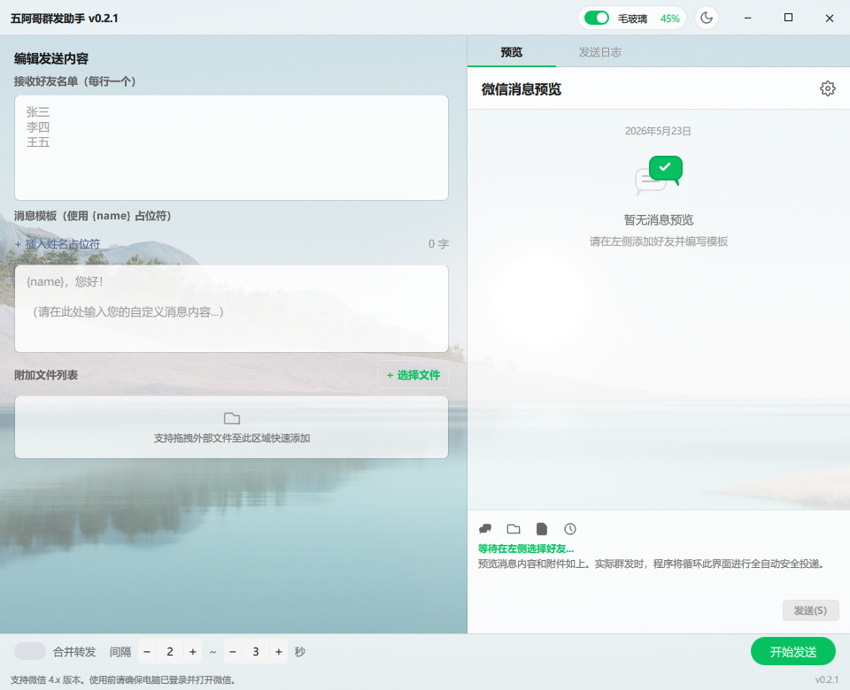

# WxAuto — 五阿哥群发助手

基于 wx4py 核心库的 Windows 微信群发桌面助手，使用 PySide6 + Qt Quick (QML) 构建。



## 功能

- **批量群发消息**：向多个微信好友/群组逐一发送定制消息
- **变量模板**：使用 `{name}` 变量，自动提取每位好友的称呼生成个性化内容
- **附件发送**：支持同时发送文件、图片等附件
- **转发合并消息**：可将聊天记录合并转发给多个好友
- **发送间隔控制**：自定义每条消息之间的延迟时间，降低封号风险
- **实时进度追踪**：发送进度、当前对象、成功/失败状态一目了然
- **发送日志**：完整的发送记录，便于回溯
- **暗色/亮色主题**：一键切换，偏好自动记忆
- **毛玻璃效果**：Windows 11 Acrylic 原生材质，可开关并调节透明度
- **演示模式**：无微信环境时自动降级为 Mock，方便开发调试

## 技术栈

| 层 | 技术 |
|---|---|
| UI | PySide6 + Qt Quick (QML) |
| 后端 | Python (QObject/Signal/Slot) |
| 微信操控 | wx4py (comtypes + UIAutomation) |
| 打包 | PyInstaller |
| 安装器 | NSIS |
| CI/CD | GitHub Actions |

## 目录结构

```
WxAuto/
├── main.py                 # 应用入口
├── app/                    # Python 后端
│   ├── _version.py         # 应用版本 (0.1.0)
│   ├── backend.py          # BackendController — 状态中枢
│   ├── sender_worker.py    # SenderWorker(QThread) — 发送线程
│   ├── models.py           # 数据模型 & 模板变量提取
│   ├── constants.py        # 常量定义
│   ├── demo.py             # 演示模式 fallback
│   └── win32_helper.py     # Win32 原生窗口效果
├── qml/                    # QML 前端
│   ├── main.qml            # 根窗口 (无边框 + 拖拽缩放)
│   ├── App.qml             # 主布局
│   ├── components/         # UI 组件 (标题栏、输入面板、日志等)
│   └── theme/              # WxTheme 单例 (颜色/字体/间距/动画)
├── src/                    # wx4py 微信自动化核心库 (0.2.1)
├── tests/                  # pytest 测试
├── build/                  # PyInstaller 打包脚本
├── installer/              # NSIS 安装器脚本
└── assets/                 # 应用图标等静态资源
```

## 开发

```bash
# 安装依赖
pip install -r requirements-dev.txt

# 运行
python main.py

# 测试
pytest tests/ -v

# 仅快速测试（排除慢速和 QML 测试）
pytest tests/ -v -m "not slow and not qml"
```

## 构建 & 安装

```bash
# 构建可执行文件 + 安装器
python build/build.py

# 产物位于 dist/
#   dist/五阿哥群发助手/         — PyInstaller 目录
#   dist/五阿哥群发助手_Setup.exe — NSIS 安装器
```

也可从 [GitHub Releases](https://github.com/basil520/wechat-courier/releases) 下载安装器或便携压缩包。

## 系统要求

- Windows 10 / 11
- 微信 PC 版已登录
- Python 3.10+（开发时）

## 许可

[MIT License](LICENSE)